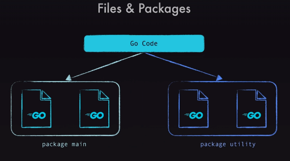
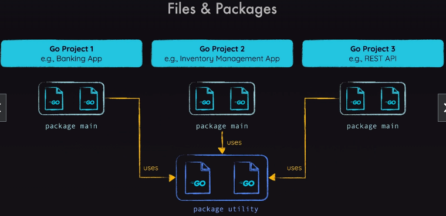

# Go Basics
> **Note:** First go to the folder where the go file is present
-  ##### To run a go application in development :
```bash
   go run firstCode.go
```
-  ##### In production :

```bash
   
   # initialize the module (on MacOS)
   go mod init /path/to/your/goFile/customModuleName
   # build the module
   go build 
   # Run the module and get the executable file (on MacOS)
   ./customModuleName
```
- Go has modules and each module has multiple packages
- Should have atleast one package in a file
- A single package can be split accross multiple go files
- Can have multiple packages in one go file also 
- [Go standard libraby for packages](https://pkg.go.dev/std)



